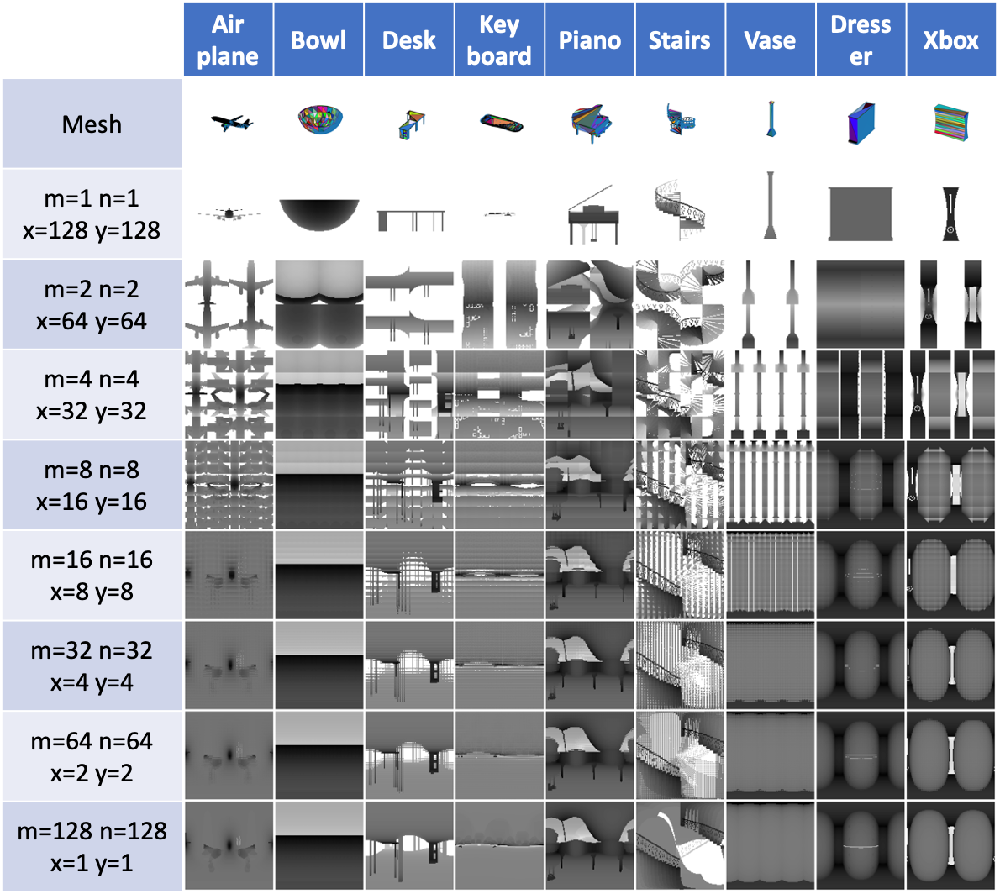
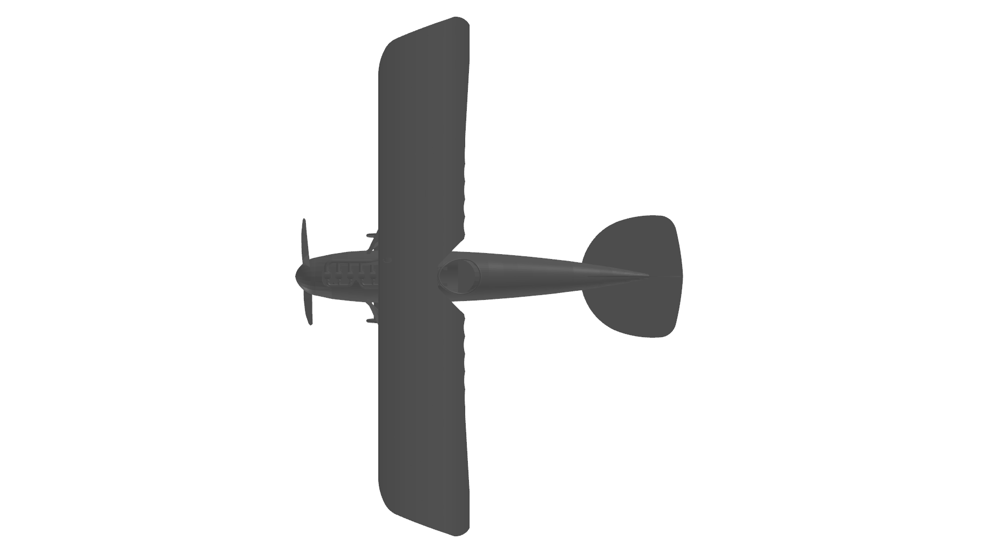
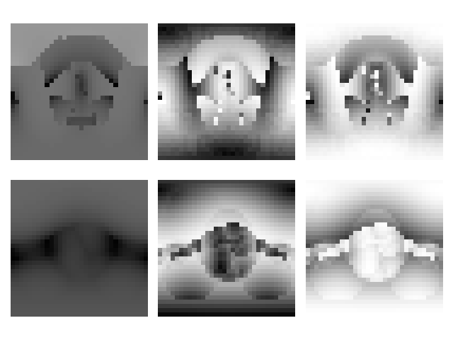

# Variable-Viewpoint (V<sup>2</sup>) Representation
This is the repo to generate the V<sup>2</sup> representation defined in the paper
[_Variable-Viewpoint Representations for 3D Object Recognition_](https://arxiv.org/pdf/2002.03131.pdf).


**Figure 1.** The rich V2 representation.</p>

## Abstract
While infants are learning the object recognition, the visual signals projecting to their eyes are
much richer than just some static photographic views. They tend to hold the object and then look all
around to generate a fused representation of the same object, for example, they may observe the whole
outlines of the object by holding the object away from their eyes, they may focus on some local patterns
continuously distributed on the object, or they may quickly rotate the object to observe the overall 3D
shape.   

Such a rich visual projecting behavior from infants play an important role to how later growing up human
can learn new objects amazingly fast without detailed observation again, and thus this paper proposed the
V<sup>2</sup> project framework to generate such a rich projecting representation and aim to reveal how
the learning process and internal representation could evolve through these rich representations inside
visual models for both computer vision and cognitive science.

## Implementation
The core algorithms implemented in this framework include the following two key components
1. rich ways to sample the projecting surface;
2. a vectorized version of 
[Möller-Trumbore intersection algorithm](https://en.wikipedia.org/wiki/M%C3%B6ller%E2%80%93Trumbore_intersection_algorithm)
to utilize GPU acceleration.

### Projecting Surface Sampling
We will first normalize a 3D object, either in .off or .obj format into a sphere, and then sample
all the project planes tangent to the sphere. The variables you have to control the surface sampling are as follows:
- _m_, int, how many view planes you want to have vertically, i.e., how many latitude lines.
- _n_, int, how many view planes you want to have horizontally, i.e., how many longitude lines.
- _w_, int, the width of each view plane.
- _h_, int, the height of each view plane.
- _d_, int, the density of each view plane, i.e., the shortest distance between two projecting points inside a view plane.
- _r_, float, the radius of the sphere, 1 for a unit sphere. 
- _polar_, bool, include the polar view or not.
- _ssm_, str, sphere sampling method, a string to specify the distribution of _m_ latitude lines and _n_
longitude lines.
  - Supported methods: ['v2_uni', 'v2_dh', 'v2_soft', 'v2_fibonacci', 's2cnn_dh', 's2cnn_soft', 'trimesh_uv']
  - Please see the V2Lib.sphere_sample in v2/v2lib.py for details. 


**Figure 2.** Various V<sup>2</sup> parameters and their corresponding
V<sup>2</sup> representations.

We also support two parameters to control the position of the loaded 3D object:
- _rot_, list, [z+, y+, x+], i.e., how many degrees you want the object to rotate around the z+, y+, and x+ axis.
- _tr_, list, [x+, y+, z+], i.e., how far you want the object to translate along the x+, y+, z+ axis.

### Vectorized Möller-Trumbore Algorithm
To project a 3D object to the 2D surface sampled above, the core algorithm is the ray-triangle intersection algorithm
since most of the meshes are formed by face triangles.
This repo implemented different ways to calculate the ray-triangle intersection which can be specified by the
- _v2m_, str, v2 generating method, a string to specify which ray-triangle algorithm to be used.
  - Supported methods: ['trimesh', 'e2f', 'mt', 's2cnn']
  - Please see the V2Lib.v2repr in v2/v2lib.py for details.
  
All these methods achieve the same goal, that is, calculating the intersection points between the rays shot from the above
projecting surface and the object, whereas 'mt' standing for Möller-Trumbore is the fastest algorithm among all
of the supported methods. By Wiki, "The Möller–Trumbore ray-triangle intersection algorithm, named after its inventors
Tomas Möller and Ben Trumbore, is a fast method for calculating the intersection of a ray and a triangle in three
dimensions without needing precomputation of the plane equation of the plane containing the triangle." Based on the
original algorithm, we implemented a vectorized version to utilize GPU acceleration to save time for the projecting
representation generating.

## Installation
You might need to install the following dependencies:
```
numpy>=1.17.3
scipy>=1.3.1
matplotlib>=3.1.1
torch>=1.3.0
torchvision>=0.4.1
trimesh>=3.2.39  # https://github.com/mikedh/trimesh
lie_learn  # https://github.com/AMLab-Amsterdam/lie_learn
```
We provided a _requirements.txt_ file, if you want to install the environment from scratch.
```
pip install -r requirements.txt
```
Then, _cd_ into this repo and install by
```
pip install -e .
```
## Example
This V<sup>2</sup> framework supports .off and .obj formats, which are the two common formats for storing
3D object mesh. The following is the example code to use the V2Generator and the V2Visualizer. You can also
find the code in the v2/example folder.
```
import math

from v2.v2gen import V2Generator
from v2.v2vis import V2Vis


def main():
    m = 32  # view row
    n = 32  # view col
    h = 1  # height per view
    w = 1  # width per view
    d = 2 / 32  # distance between two closest pixels
    r = 1  # sphere radius
    polar = True  # sampling viewpoint on polar or not
    ssm = 'v2_soft'  # sphere sampling method
    v2m = 'mt'  # v2 generating method
    tr = [0, 0, 0]  # List[x+, y+, z+] translation distance
    rot = [0 / 12 * 2 * math.pi, 0 / 12 * 2 * math.pi, 0 / 12 * 2 * math.pi]  # List[z+, y+, x+] euler angles

    v2generator = V2Generator(m, n, w, h, d, r, polar, ssm, v2m, rot, tr)

    off_file = 'mesh/airplane_0001.off'
    v2generator(off_file)

    v2visualizer = V2Vis(v2generator)

    v2visualizer.plt_mesh()
    v2visualizer.plt_v2_repr()
    v2visualizer.plt_v2_config(mesh_p=True, convh_p=False, mesh=True, convh=False)


if __name__ == '__main__':
    main()
```
Here are the expected outputs generated from the example code.

```v2visualizer.plt_mesh()``` | ```v2visualizer.plt_v2_repr()``` | ```v2visualizer.plt_v2_config(mesh_p=True, convh_p=False, mesh=True, convh=False)```
------------------------------|--------------------------------- | ------------------------------------------------------------------------------------
 |  | 

**Figure 3.** Expected outputs of the example code.

## Acknowledgment
This work was done at [AIVAS Lab](https://my.vanderbilt.edu/aivaslab/), [Vanderbilt University](https://www.vanderbilt.edu/).
Thanks so much for the incredible guidance from [Dr. Maithilee Kunda](https://my.vanderbilt.edu/mkunda/).
I'm so lucky that I could become her student in my lifetime. Thanks so much for my Lab mates, [Xiaohan, James, Joel,
Deepayan, and Ryan](https://my.vanderbilt.edu/aivaslab/people/). It is impossible to finish this project
without the discussion, suggestion, and help from you all.

Thank you! :)